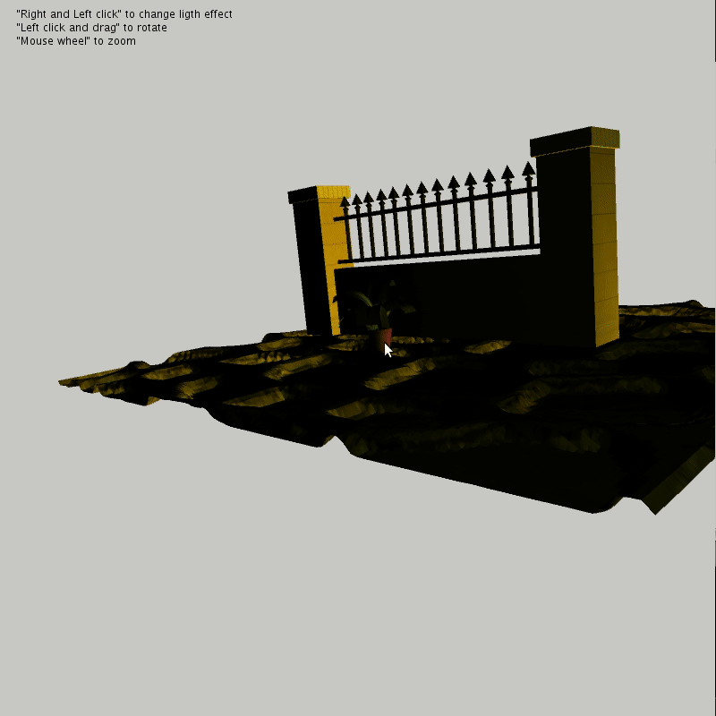

# Luces y Texturas con Processing 

## Sobre el Autor

> **Miguel Lincoln Capote Pratts** - Universidad de Las Palmas de Gran Canaria [**ULPGC**](https://www.ulpgc.es).

## Desarrollo

Es necesario añadir la libreria 
 [Libreria PeasyCam](https://github.com/jdf/peasycam) a processing.

El objetivo de esta práctica es hacer uso de las herramientas de iluminación que nos proporciona processing
 así como las posibilidades que nos da para añadir objetos con texturas propias [Véase las referencias]. La escena consta de una pared, suelo y una planta. Se va observando como se ve los diferentes tipos de luz presentados según el usuario presiona el click derecho o izquierdo. Para facilitar el uso de la cámara se utilizo
 una librería de processing
 llamada PeasyCam que no proporciona una API
 bastante completa sobre el uso de la cámara. Por ejemplo se utilizo
 esta API
 para crear el HUB
 que nos permite mostrar al usuario los comandos que puede utilizar.

## Referencias y Librerías utilizadas

Se desarrollo
 utilizando como referencia la página oficial de processing. 
 
 [Libreria PeasyCam](https://github.com/jdf/peasycam) 
 [Textura de la pared](https://free3d.com/3d-model/wall-56350.html) 
 [Textura del suelo](https://free3d.com/3d-model/cobblestones-2-41224.html) 
 [Textura de la planta](https://free3d.com/3d-model/house-plant-01-60848.html)
